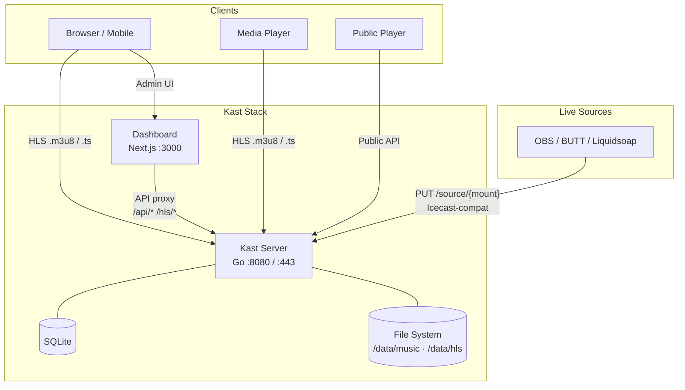

# Kast

A lightweight, self-hosted internet radio streaming server. Drop in audio files, create playlists, and broadcast HLS streams — no complex setup required.

<!-- TODO: Uncomment when public repo is ready
[](https://go.dev)
[](https://nextjs.org)
[](LICENSE)
[](https://hub.docker.com/r/riza/kast)
-->

## Features

- **HLS Streaming** — Serve audio as HTTP Live Streaming, playable in any modern browser or media player
- **AutoDJ** — Automatic playback with sequential or shuffle modes, crossfade, skip and queue management
- **Media Library** — Scan directories for audio files, upload via browser, import from YouTube
- **Playlists** — Create and manage playlists; assign them to mounts for continuous playback
- **Live Source Input** — Icecast-compatible `PUT /source/{mount}` for OBS, BUTT, Liquidsoap, and similar tools
- **Public Player** — Embeddable web player with now-playing info and track history
- **Dashboard** — Modern admin UI built with Next.js, shadcn/ui, and Tailwind CSS
- **SSL / Custom Domain** — Built-in Let's Encrypt auto-cert, manual TLS, or pair with Cloudflare
- **Docker Ready** — Single `docker compose up` to run the full stack
- **Minimal Dependencies** — Go binary + ffmpeg; SQLite for state

## Architecture



## Quick Start

```bash
git clone https://github.com/riza/kast.git
cd kast && cp .env.example .env
docker compose up -d
```

The dashboard is available at `http://localhost:3000`. On first run a random API key is auto-generated and printed to the server log:

```bash
docker compose logs server | grep "Generated API key"
```

Enter that key in **Dashboard → Settings → Connection**.

### Production Builds

For reproducible, versioned images use the Makefile targets:

```bash
make docker-build    # build images with git tag, commit hash, and timestamp baked in
make docker-up       # start the stack
```

The Makefile injects build metadata (`VERSION`, `GIT_COMMIT`, `BUILD_TIME`) into the Go binary via linker flags, which appears in logs and the `/api/status` response. This is useful for debugging which commit is running in production.

### Manual Setup (dev)

**Prerequisites:** Go 1.25+, Node.js 22+, ffmpeg

```bash
# Server
cd server
go run ./cmd/kast -config kast.toml

# Dashboard (separate terminal)
cd dashboard
npm install
npm run dev
```

### Add Music & Start Streaming

1. Place audio files in `server/data/music/` (or upload via the dashboard)
2. Open the dashboard at `http://localhost:3000`
3. Create a mount point (e.g. `radio`)
4. Create a playlist and add tracks
5. Start AutoDJ on your mount
6. Listen at `http://localhost:8080/player/radio`

## Configuration

Kast is configured via a single TOML file (`server/kast.toml`). The Docker entrypoint auto-generates it on first run from the bundled example. All keys can be overridden via environment variables — see [`.env.example`](.env.example).

| Section | Key Options |
|---------|-------------|
| `[server]` | `http_addr`, `public_url`, `cors_origins`, `trust_proxy` |
| `[admin]` | `api_key`, `jwt_secret` |
| `[hls]` | `segment_duration`, `playlist_size`, `output_dir` |
| `[library]` | `scan_dirs`, `audio_extensions` |
| `[autodj]` | `default_mode` (sequential/shuffle), `crossfade_ms` |
| `[ssl]` | `enabled`, `auto_cert`, `domains`, `cert_file`, `key_file` |
| `[log]` | `level` (debug/info/warn/error), `format` (text/json) |

## Documentation

| Guide | Description |
|-------|-------------|
| [API Reference](docs/api-reference.md) | All endpoints with request / response schemas |
| [Deployment](docs/deployment.md) | Cloudflare, Let's Encrypt, reverse proxy — step by step |
| [Webhooks](docs/webhooks.md) | Event types, payload schemas, signature verification |
| [Scheduled Playlists](docs/scheduled-playlists.md) | Time-based AutoDJ rotation |
| [Jingle Insertion](docs/jingle-insertion.md) | Per-mount ad / jingle scheduling |

## Project Structure

```
kast/
├── server/                    # Go streaming server
│   ├── cmd/kast/              # Entry point
│   ├── internal/
│   │   ├── api/               # HTTP router, middleware, handlers
│   │   ├── autodj/            # AutoDJ player (ffmpeg-based)
│   │   ├── config/            # TOML config parser
│   │   ├── djmanager/         # DJ session manager
│   │   ├── hls/               # HLS segmenter
│   │   ├── library/           # Media library scanner
│   │   ├── mount/             # Mount point manager
│   │   ├── playlist/          # Playlist CRUD
│   │   ├── source/            # Live source handler
│   │   └── ytimport/          # YouTube import (yt-dlp)
│   ├── kast.toml              # Configuration template
│   └── Dockerfile
├── dashboard/                 # Next.js admin dashboard
│   ├── app/                   # App Router pages
│   ├── components/            # UI components (shadcn/ui)
│   └── Dockerfile
├── docker-compose.yml
└── README.md
```

## Roadmap

- [x] Crossfade between tracks
- [x] Live source → HLS pipeline (connect incoming audio to segmenter)
- [x] Scheduled playlists — [docs](docs/scheduled-playlists.md)
- [x] Jingle/ad insertion — [docs](docs/jingle-insertion.md)
- [x] Webhooks — [docs](docs/webhooks.md)
- [ ] Track metadata editing (artist/title/tags — mount-level metadata already supported)
- [ ] Song request system (listeners request tracks via public API)
- [ ] Listener analytics history (persistent time-series — current counts already live)
- [ ] Web DJ / WHIP ingress (WHEP egress already supported)
- [x] Low-Latency HLS (LL-HLS) support

## Contributing

Contributions are welcome! Please see [CONTRIBUTING.md](CONTRIBUTING.md) for guidelines.

1. Fork the repository
2. Create a feature branch (`git checkout -b feature/amazing-feature`)
3. Commit your changes
4. Push to the branch and open a Pull Request

## Tech Stack

| Layer | Technology |
|-------|------------|
| Server | Go 1.25, Fiber v2, ffmpeg |
| Dashboard | Next.js 16, React 19, Tailwind CSS 4, shadcn/ui |
| Streaming | HLS (HTTP Live Streaming) |
| Media Processing | ffmpeg (transcoding, segmenting) |
| YouTube Import | yt-dlp |
| Containerization | Docker, Docker Compose |

## License

This project is licensed under the MIT License — see the [LICENSE](LICENSE) file for details.
