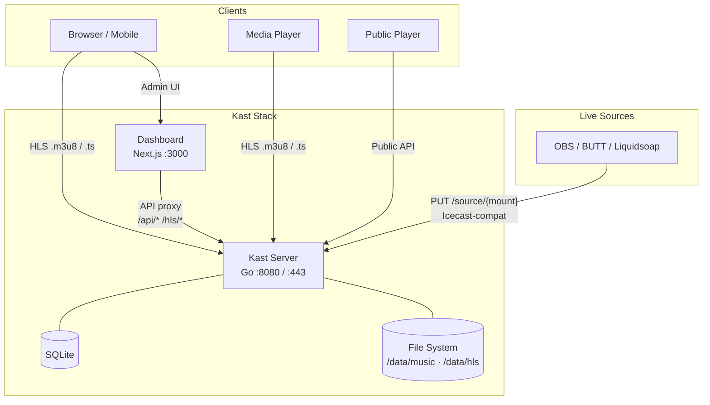
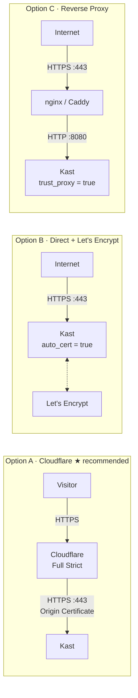

# Kast

A lightweight, self-hosted internet radio streaming server. Drop in audio files, create playlists, and broadcast HLS streams — no complex setup required.

<!-- TODO: Uncomment when public repo is ready
[](https://go.dev)
[](https://nextjs.org)
[](LICENSE)
[](https://hub.docker.com/r/riza/kast)
-->

## Features

- **HLS Streaming** — Serve audio as HTTP Live Streaming, playable in any modern browser or media player
- **AutoDJ** — Automatic playback with sequential or shuffle modes, crossfade, skip and queue management
- **Media Library** — Scan directories for audio files, upload via browser, import from YouTube
- **Playlists** — Create and manage playlists; assign them to mounts for continuous playback
- **Live Source Input** — Icecast-compatible `PUT /source/{mount}` for OBS, BUTT, Liquidsoap, and similar tools
- **Public Player** — Embeddable web player with now-playing info and track history
- **Dashboard** — Modern admin UI built with Next.js, shadcn/ui, and Tailwind CSS
- **SSL / Custom Domain** — Built-in Let's Encrypt auto-cert, manual TLS, or pair with Cloudflare
- **Docker Ready** — Single `docker compose up` to run the full stack
- **Minimal Dependencies** — Go binary + ffmpeg; SQLite for state

## Architecture



## Quick Start

### Docker Compose (recommended)

```bash
git clone https://github.com/riza/kast.git
cd kast
docker compose up -d
```

The dashboard is available at `http://localhost:3000`. On first run a random API key is auto-generated and printed to the server log:

```bash
docker compose logs server | grep "Generated API key"
```

Enter that key in **Dashboard → Settings → Connection**.

### Manual Setup

**Prerequisites:** Go 1.25+, Node.js 22+, ffmpeg

```bash
# Server
cd server
go build -o kast ./cmd/kast
./kast -config kast.toml

# Dashboard (separate terminal)
cd dashboard
npm install
npm run dev
```

### Add Music & Start Streaming

1. Place audio files in `server/data/music/` (or upload via the dashboard)
2. Open the dashboard at `http://localhost:3000`
3. Create a mount point (e.g. `radio`)
4. Create a playlist and add tracks
5. Start AutoDJ on your mount
6. Listen at `http://localhost:8080/player/radio`

## Configuration

Kast is configured via a single TOML file (`server/kast.toml`). The Docker entrypoint auto-generates it on first run from the bundled example. All keys can be overridden via environment variables — see [`.env.example`](.env.example).

| Section | Key Options |
|---------|-------------|
| `[server]` | `http_addr`, `public_url`, `cors_origins`, `trust_proxy` |
| `[admin]` | `api_key`, `jwt_secret` |
| `[hls]` | `segment_duration`, `playlist_size`, `output_dir` |
| `[library]` | `scan_dirs`, `audio_extensions` |
| `[autodj]` | `default_mode` (sequential/shuffle), `crossfade_ms` |
| `[ssl]` | `enabled`, `auto_cert`, `domains`, `cert_file`, `key_file` |
| `[log]` | `level` (debug/info/warn/error), `format` (text/json) |

## Production Deployment

Three deployment models are supported:



---

### Option A — Cloudflare + Origin Certificate ★

The simplest production setup for Cloudflare users. Cloudflare issues a free origin certificate valid for **15 years** — no renewal, no ACME challenges, no port 443 required on the firewall for cert issuance.

**1. Create a Cloudflare Origin Certificate**

In the Cloudflare dashboard: **SSL/TLS → Origin Server → Create Certificate**.
Accept the defaults (RSA, 15-year validity), add your hostname(s), and click Create.
Download both files:

- **Origin Certificate** → save as `certs/origin.pem`
- **Private Key** → save as `certs/origin.key`

Place them in a `certs/` directory at the root of the repo (next to `docker-compose.yml`).

**2. Configure your `.env`**

```bash
KAST_PUBLIC_URL=https://radio.example.com
KAST_CORS_ORIGINS=https://radio.example.com
KAST_SSL_ENABLED=true
KAST_SSL_CERT_FILE=/app/certs/origin.pem
KAST_SSL_KEY_FILE=/app/certs/origin.key
KAST_TRUST_PROXY=true
```

**3. Uncomment port 443 and the cert volume in `docker-compose.yml`**

```yaml
ports:
  - "8080:8080"
  - "443:443"       # ← uncomment
volumes:
  # ...
  - ./certs:/app/certs:ro   # ← uncomment
```

**4. Set Cloudflare SSL mode to Full (strict)**

In the Cloudflare dashboard: **SSL/TLS → Overview → Full (strict)**.

**5. Restart**

```bash
docker compose down && docker compose up -d
```

---

### Option B — Direct + Let's Encrypt

Kast obtains and renews TLS certificates automatically via ACME HTTP-01. Port 443 must be reachable from the internet; Cloudflare proxying (orange cloud) must be **off** for the domain.

In your `.env`:

```bash
KAST_PUBLIC_URL=https://radio.example.com
KAST_SSL_ENABLED=true
KAST_SSL_DOMAINS=radio.example.com
```

Uncomment port 443 in `docker-compose.yml`:

```yaml
ports:
  - "8080:8080"
  - "443:443"
```

Kast fetches the certificate on first startup and renews it automatically. The HTTP listener on `:8080` becomes a permanent redirect to HTTPS.

Alternatively, configure directly in `kast.toml`:

```toml
[ssl]
enabled   = true
auto_cert = true
domains   = ["radio.example.com"]
cert_dir  = "./data/certs"
```

---

### Option C — Reverse Proxy (nginx / Caddy)

Let your reverse proxy handle TLS termination and pass plain HTTP to Kast. Set `KAST_TRUST_PROXY=true` so Kast reads the real client IP from `X-Forwarded-For`.

**Caddy** (automatic HTTPS, simplest):

```caddyfile
radio.example.com {
    reverse_proxy localhost:8080
}
```

**nginx** (snippet):

```nginx
server {
    listen 443 ssl;
    server_name radio.example.com;

    ssl_certificate     /path/to/fullchain.pem;
    ssl_certificate_key /path/to/privkey.pem;

    location / {
        proxy_pass http://localhost:8080;
        proxy_set_header Host              $host;
        proxy_set_header X-Forwarded-For   $remote_addr;
        proxy_set_header X-Forwarded-Proto $scheme;
    }
}
```

In `.env`:

```bash
KAST_TRUST_PROXY=true
```

---

## API Reference

All admin endpoints require `Authorization: Bearer <api_key>`.

| Method | Endpoint | Description |
|--------|----------|-------------|
| `GET` | `/api/status` | Server status |
| `GET` | `/api/mounts` | List all mount points |
| `POST` | `/api/mounts` | Create a mount point |
| `GET` | `/api/mounts/{name}` | Get mount details |
| `DELETE` | `/api/mounts/{name}` | Delete a mount point |
| `POST` | `/api/mounts/{name}/autodj` | Start AutoDJ on mount |
| `DELETE` | `/api/mounts/{name}/autodj` | Stop AutoDJ |
| `POST` | `/api/mounts/{name}/autodj/skip` | Skip current track |
| `GET` | `/api/mounts/{name}/nowplaying` | Now playing info |
| `GET` | `/api/library` | List library tracks |
| `POST` | `/api/library/upload` | Upload audio files |
| `POST` | `/api/library/scan` | Trigger library scan |
| `GET` | `/api/playlists` | List playlists |
| `POST` | `/api/playlists` | Create playlist |
| `PUT` | `/api/playlists/{id}` | Update playlist |
| `DELETE` | `/api/playlists/{id}` | Delete playlist |

**Public endpoints** (no auth required):

| Method | Endpoint | Description |
|--------|----------|-------------|
| `GET` | `/hls/{mount}/*.m3u8` | HLS playlist |
| `GET` | `/hls/{mount}/*.ts` | HLS segments |
| `GET` | `/player/{mount}` | Web player page |
| `GET` | `/public/{mount}` | Mount info + now playing |
| `GET` | `/public/{mount}/history` | Recently played tracks |
| `GET` | `/public/{mount}/playlist` | Current playlist tracks |
| `PUT` | `/source/{mount}` | Live source input (Icecast-compatible) |

## Project Structure

```
kast/
├── server/                    # Go streaming server
│   ├── cmd/kast/              # Entry point
│   ├── internal/
│   │   ├── api/               # HTTP router, middleware, handlers
│   │   ├── autodj/            # AutoDJ player (ffmpeg-based)
│   │   ├── config/            # TOML config parser
│   │   ├── djmanager/         # DJ session manager
│   │   ├── hls/               # HLS segmenter
│   │   ├── library/           # Media library scanner
│   │   ├── mount/             # Mount point manager
│   │   ├── playlist/          # Playlist CRUD
│   │   ├── source/            # Live source handler
│   │   └── ytimport/          # YouTube import (yt-dlp)
│   ├── kast.toml              # Configuration template
│   └── Dockerfile
├── dashboard/                 # Next.js admin dashboard
│   ├── app/                   # App Router pages
│   ├── components/            # UI components (shadcn/ui)
│   └── Dockerfile
├── docker-compose.yml
└── README.md
```

## Roadmap

- [ ] Crossfade between tracks
- [ ] Live source → HLS pipeline (connect incoming audio to segmenter)
- [ ] Scheduled playlists (time-based rotation)
- [ ] Jingle/ad insertion (every N songs or N minutes)
- [ ] Webhooks (track change, listener connect/disconnect)
- [ ] Metadata editing
- [ ] Song request system (listeners request tracks via public API)
- [ ] Listener analytics history
- [ ] Web DJ (browser-based live broadcasting via WebRTC)
- [ ] Low-Latency HLS (LL-HLS) support

## Contributing

Contributions are welcome! Please see [CONTRIBUTING.md](CONTRIBUTING.md) for guidelines.

1. Fork the repository
2. Create a feature branch (`git checkout -b feature/amazing-feature`)
3. Commit your changes
4. Push to the branch and open a Pull Request

## Tech Stack

| Layer | Technology |
|-------|------------|
| Server | Go 1.25, Fiber v2, ffmpeg |
| Dashboard | Next.js 16, React 19, Tailwind CSS 4, shadcn/ui |
| Streaming | HLS (HTTP Live Streaming) |
| Media Processing | ffmpeg (transcoding, segmenting) |
| YouTube Import | yt-dlp |
| Containerization | Docker, Docker Compose |

## License

This project is licensed under the MIT License — see the [LICENSE](LICENSE) file for details.
